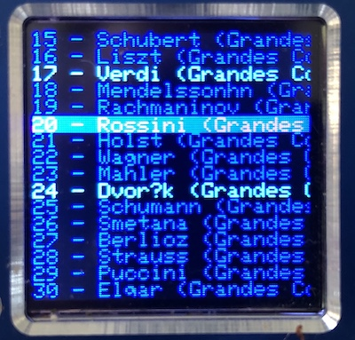
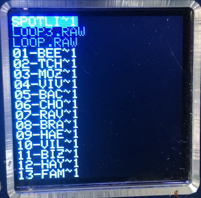

# teensy tft sd browser
uSD card directory browser for teensy 3.6

**(work in progress)**

This is a quick proof-of-concept to display contents of uSD card, allowing user to select a file or directory. 
* display files and directories on a ST7735 tft display 128x128
* highlights selected file/directory
* scroll up or down using rotary encoder
* displays previous/next page

# dependencies
* Either 
  * SdFs (https://github.com/greiman/SdFs) for use with long file name), or 
  * SD (https://github.com/PaulStoffregen/SD)
* ST7735_t3 (https://github.com/PaulStoffregen/ST7735_t3)
* Bounce
* Encoder

